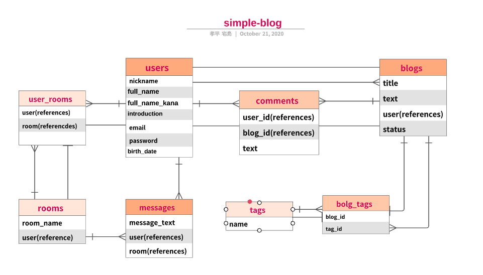

# README

# アプリケーション名
- simple-blog

# アプリケーション概要
- ブログ記事投稿サイトです。
- ユーザーの登録・登録内容の変更ができます。
- ブログ記事を投稿できます（画像は見出しのみで文字のみの記事）。
- ブログ記事の編集・削除ができます。
- ブログ記事をタイトル名の一部で検索することができます。
- 他のユーザーのブログ記事にコメントを残すことができます。

# URL
- https://simple-blog29760.herokuapp.com/ 
- https://github.com/shirohige3/simple-blog

# テスト用アカウント
| test-user  | email              | password     |
| ---------- | ------------------ | ------------ |
| tanaka     | tanaka12@gmail.com | tanaka12     |
| suzuki     | suzuki12@gmail.com | suzuki12     |

# 利用方法
# header
- 『記事検索』はタイトルを入れることで記事を検索できます。
- 『新規登録』はユーザーを新しく登録できます。
- 『ログイン』は既に登録してあるユーザーのemailとpasswordでログインできます。
- ユーザーがログインしている状態だと『ユーザー名』はマイページへ遷移できます。
- 『ログアウト』はログインしているユーザーをログアウトさせます。
# side-bar
- 『記事を書く』からブログ記事の投稿ができます。タイトルと記事内容は必須です。
- 『一覧へ戻る』はどこからでもトップページへ遷移します。
- 『コメント』は自分以外のユーザーのブログ記事へコメントを書くことができます。
- 『編集』は自分のブログ記事に対して編集が行えます。
- 『削除』は自分のブログ記事を削除することができます。
- 『過去記事一覧』はmain-contentsの部分のものが文字のみで表示されます。
- 『マイページ』は自分のブログ記事のみを表示できます。
- 『プロフィール』は自分の登録した情報を変更できます。現時点では『nickname』『email』『password』『introduction』のみです。
# main-contents
- ブログ記事が降順で新着順に掲載されます。
- ブログ記事をクリックするとその記事の詳細ページへ遷移します。

# 目指した課題解決
- 10~20代の方（性別不問）の、ブログ記事を書いて投稿したい。
- twitterなどでつながっているフォロワーや趣味の会う人とチャットなどで盛り上がりたい。

# 洗い出した要件
| 機能               | 目的                                                         |
| ------------------ | -------------------------------------------------------------|
| ユーザー管理機能   | ユーザーの管理・編集が目的です                               |
| ブログ管理機能     | ブログの投稿・管理・検索が目的です                           |
| コメント機能       | ブログへのコメント管理・投稿が目的です                       |
| タグ検索機能       | ブログへタグを設定して検索を容易にすることが目的です         |
| 画像投稿機能       | ユーザー・ブログ・メッセージへ画像を添付できることが目的です |
| メッセージ機能     | 個別にメッセージを送り合う場所を作ることが目的です           |
| フレンド機能       | ユーザー間の繋がりを強くするのが目的です                     |
| SNS連携機能        | 登録への敷居を下げ、登録を容易にすることが目的です           |
| レスポンシブ機能   | 様々な画面サイズに合わせたサイズ変更が目的です               |
# 実装した機能についての説明
| 機能               | 目的                                                         |
| ------------------ | -------------------------------------------------------------|
| ユーザー管理機能   | ユーザーの新規登録・ログイン・ログアウトができます           |
| ブログ管理機能     | ブログの投稿・編集・削除・検索ができます                     |
| コメント機能       | ブログへのコメント投稿ができます                             |
| タグ検索機能       | ブログへタグを設定して検索を容易にすることが目的です         |
| フォロー機能       | 自分以外のユーザーをフォローすることができます               |
| メッセージ機能     | フォローしているユーザーへメッセージを送る事ができます       |
# 実装予定の機能
- SNS連携機能
- レスポンシブ機能

# データベース・テーブル設計

## users テーブル
| Column           | Type       | Options          |
| ---------------- | -----------| ---------------- |
| nickname         | string     | null: false      |
| email            | string     | null: false      |
| password         | string     | null: false      |
| introduction     | text       |                  |
| full_name        | string     | null: false      |
| full_name_kana   | string     | null: false      |
| birth_date       | date       |                  |
### Association
- has_many         :blogs
- has_many         :comments
- has_many         :messages
- has_one_attached :image
- has_many :follower, class_name: "Relationship", foreign_key: "follower_id", dependent: :destroy
- has_many :followed, class_name: "Relationship", foreign_key: "followed_id", dependent: :destroy

## blogs テーブル
| Column           | Type       | Options                        |
| ---------------- | -----------| ------------------------------ |
| title            | string     | null: false                    |
| status           | integer    | null: false,  default: 0       |
| user             | references | null: false, foreign_key: true |
### Association
- belongs_to       :user
- has_many         :comments
- has_many         :blog_tags
- has_many         :tags through: :blog_tags
- has_one_attached :image

## comments テーブル
| Column           | Type           | Options                        |
| ---------------- | ---------------| ------------------------------ |
| user             | references     | null: false, foreign_key: true |
| blog             | references     | null: false, foreign_key: true |
| text             | text           | null: false                    |

### Association
- belongs_to  :user
- belongs_to  :blog

## tags テーブル
| Column           | Type       | Options                       |
| ---------------- | -----------| ----------------------------- |
| tag_name         | string     | uniqueness: true              |

### Association
- has_many  :blog_tags
- has_many  :blogs through: blog_tags

## rooms テーブル
| Column           | Type       | Options                        |
| ---------------- | -----------| ------------------------------ |
### Association
- has_many  :messages
- has_many  :usr_rooms
- has_many  :users through: :user_rooms

## messages テーブル
| Column           | Type       | Options                        |
| ---------------- | -----------| ------------------------------ |
| message_text     | text       | null: false                    |
| user             | references | null: false, foreign_key: true |
| room             | references | null: false, foreign_key: true |
### Association
- belongs_to  :user
- belongs_to  :room
- has_one_attached :image

## blog_tags テーブル
| Column           | Type       | Options                        |
| ---------------- | -----------| ------------------------------ |
| blog             | references | null: false, foreign_key: true |
| tag              | references | null: false, foreign_key: true |
### Association
- belongs_to :blog
- belongs_to :tag

## user_rooms テーブル
| Column           | Type       | Options                        |
| ---------------- | -----------| ------------------------------ |
| user             | references | null: false, foreign_key: true |
| room             | references | null: false, foreign_key: true |
### Association
- belongs_to :user
- belongs_to :room

## relationship テーブル
| Column           | Type       | Options                        |
| ---------------- | -----------| ------------------------------ |
| follower         | integer    |                                |
| followed         | integer    |                                |
### Association
- belongs_to :following_user, through: :follower, source: :followed
- belongs_to :follower_user, thorough: :followed, source: :follower

# ローカルでの動作方法
# gitclone用URL
https://github.com/shirohige3/simple-blog.git

This README would normally document whatever steps are necessary to get the
application up and running.

Things you may want to cover:

* Ruby version  ruby 2.6.5

* System dependencies

* Configuration

* Database creation

* Database initialization

* How to run the test suite

* Services (job queues, cache servers, search engines, etc.)

* Deployment instructions

* ...